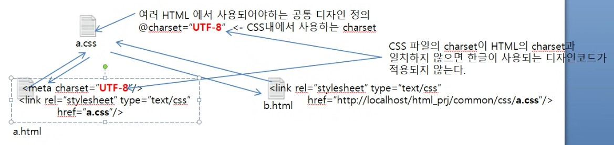

# CSS (Cascading Style Sheet)
- 하콩 비움 리가 1994년 제안한 Style Sheet 언어
- 웹 디자이너가 주로 사용하는 Style Sheet 언어
- 웹 페이지에서 통일성 있는 디자인을 제공할 때
- CSS의 대표 Framework-bootstrap
- 3가지의 방법으로 사용할 수 있다.
	- inline, embed, external file
- CSS는 에러가 발생하지 않는다.

문법)
속성: 값

사용법)
*inline 방식
- HTML tag에 style 속성을 사용하여 직접 정의하는 방식
- selector가 사용되지 않는다(디자인 적용받을 태그에 직접 작성하기 때문에 selector가 필요x)
특징: 디자인 적용 우선 순위가 가장 높다.<br>
단점: 디자인 코드의 중복성이 가장 높다.<br>

문법)
``<태그명 style="속성: 값; 속성: 값; 속성: 값;,,,">``

*embed 방식
- HTML의 `<head>`태그 사이에 `<style>`태그를 정의하고, 디자인 코드를 작성하는 방식
- external file 방식보다는 적용 우선순위가 높다
- 디자인 코드의 중복성을 낮출 수 있다.
- selector가 사용된다.
- `<style>`태그가 선언된 HTML에서만 사용된다. (다른 HTML 페이지에서 동일한 디자인을 사용하고 싶다면, 해당 페이지의 디자인 코드를 CSS파일에서 다시 만들어서 사용해야 한다. =>external file 방식)
- 특정 페이지에서만 사용되는 디자인을 정의해야할 때 

문법)
```CSS
<style type="text/css">
	선택자{속성:값; 속성:값; ,,,}
</style>
```

*external file 방식
- CSS코드를 확장자가 .css인 파일을 생성하고, 그 안에 정의하는 방식
- 디자인 코드의 중복성이 가장 낮다.
- 디자인 코드의 적용 우선 순위가 가장 낮다.(inline-> embed-> externalfile)
- selector를 사용하여 코드를 작성
- 로딩 속도가 가장 느리다.
- 여러 페이지에서 사용되는 공통 디자인을 정의할 때 가장 적합(특정 페이지에서만 사용되는 디자인은 embed 방식이 적합)
- 공통디자인이 필요한 html에서 <link rel="stylesheet" type="text/css" href="CSS URL"/> 태그를 사용하여 외부 파일 방식으로 정의된 CSS와 연결하여 사용

사용법)



## Web Site
- 대상: 일반사용자
- 별도에 사용자 교육 없이 사용 가능
- 업무 로직이 복잡하지 않다
- web agency에서 주로 개발(PHP,ASP,JSP)

## Web Application
- 대상: 기업에서 일을 하는 사원
- 별도의 사용자 교육이 필요
- 현업의 업무를 알아야 하기 때문에 구현의 난이도가 web site보다 높다.

## CSS 속성
- 글꼴 관련 속성
- 글꼴 설정: font-family: 글꼴,,,;
	- 복합값: 앞에 선언한 글꼴이 접속자에게 적용되지 않으면 뒤에 있는 글꼴로 적용된다.
	- 값은 글꼴, '글꼴', "글꼴"

- 진하게: font-weight: 값;
	- Normal: 일반 글자, bold: 진하게
- 이탤릭: font-style: 값;
	- Mormal: 일반 글자, italic: 이탤릭체
- 글자색(전경색-forground-color): color: 값;
- 글자크기: font-size: 값;
	- 크기px
- 밑줄, 취소선, 윗 줄: text-decoration: 값;
	- none
	- underline
	- line-through
	- overline