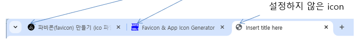

# Favicon 만들기
- 사이트를 시각적으로 보여주기 위한 브라우저 탭의 아이콘
- icon을 제작하는 site: https://www.favicon-generator.org/

1. 생성된 ico를 이미지를 웹서비스가 가능한 위치에 배포

2. HTML
`<link rel="shortcut icon" href="favicon.ico"/>`

## HTML5 디자인 태그
- 디자인 사용되는 태그로 실제일을 하지 않고, 의미적인 용도로만 사용되는 태그들
`<header>`: 디자인 구조상 header임을 알려줄 때 사용 
`<section>`: 게시글(`<article>`)의 모임이나 특정 영역임을 알려줄 때 사용 
`<article>`: 게시글을 모임 
`<footer>`: 디자인 구조상 footer임을 알려줄 때 사용 
`<aside>`: 본문이외에 추가되는 내용임을 알려줄 때 사용 

### 디자인 태그를 사용하지 않은 디자인
- 디자인의 구조가 눈에 잘 띄이지 않는다.

### 디자인 태그를 사용한 디자인
- 가독성 향상
