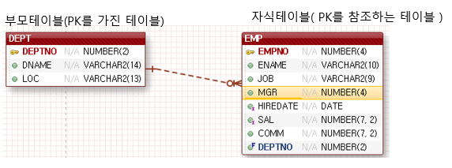

## Constraint(제약사항)
- 개발자가 원하는 값을 컬럼에 저장하기 위해서 사용하는 것
- primary key, foreign key, unique, not null, check, default(제약사항은 아니지만 같이 묶여서 본다, user_tab cols DD에서 확인)
- user_constraints DD에서 테이블에 설정된 제약사항을 확인할 수 있다.
- column단위 제약사항 또는 table 단위 제약사항으로 설정할 수 있다.
- alter를 사용해서 제약사항을 편집할 수 있다.

문법)
```sql
create table 테이블명(
 컬럼명 데이터형(크기) constraint 제약사항명 제약사항종류,
 컬럼명 데이터형(크기) constraint 제약사항명 제약사항종류,

 constraint 제약사항명 제약사항종류(적용컬럼명),
 constraint 제약사항명 제약사항종류(적용컬럼명),
);
```

### 컬럼단위 제약사항(column level constraint)
- 제약사항을 적용받을 컬럼 뒤에 선언하기 때문에 제약사항을 적용받을 컬럼명을 명시하지 않는다.
- 모든 제약사항을 설정할 수 있다.

### 테이블단위 제약사항(table level constraint)
- 컬럼의 선언이 모두 종료된 후 제약사항을 선언하기 때문에 제약사항을 적용받을 컬럼명을 명시한다.
- primary key, foreign key, unique, check만 사용가능

------------------------------------------------------------------------
### primary key(주키, 기본키)
- 테이블에 하나만 설정할 수 있다.
- 컬럼의 값이 null을 허용하지 않고, 유일해야 하는 경우
- 단일 컬럼으로 구성되는 경우도 있고, 복합 컬럼으로 구성될 수도 있다.
- 다른 테이블(자식 테이블)에서 부모테이블로 참조할 수 있다.



- primary key를 생성하면 Oracle에서는 index를 자동 생성해준다.

문법)
*컬럼단위
```sql
create table 테이블명(
 컬럼명 데이터형(크기) constraint PK_테이블명 primary key,
```
 
*테이블단위
```sql
create table 테이블명(
 컬럼명 데이터형(크기) 
 
 constraint PK_테이블명 primary key(적용컬럼,,,,)
```

여러 칼럼이 하나의 primary key로 구성되는 경우.
- 테이블단위 제약사항으로만 설정 할 수 있다.

문법)
```sql
create table 테이블명(
 컬럼명 데이터형(크기), 
 컬럼명 데이터형(크기),
 컬럼명 데이터형(크기),
 constraint PK_테이블명
```

### foreign key(외래키, 참조키)
- 다른 테이블의 PK, unique 컬럼 값으로만 컬럼값이 구성되어야 할 때
- null을 허용한다. 값이 있을 때에는 부모테이블에 존재하는 값으로만 저장한다.
- 테이블간의 관계 설정된다. (PK-부모테이블, FK-자식테이블)
- 컬럼단위 제약사항과 테이블단위 제약사항 두 가지로 설정할 수 있다.
- 하나의 테이블은 여러 개의 FK를 가질 수 있다.
- 자식테이블에서 컬럼명은 달라도 되나, 부모테이블에서 참조하는 데이터형과 크기는 동일하게 설정해야 한다.

문법)
*컬럼단위 - foreign key를 기술할 수 없다.
```sql
create table 테이블명(
 컬럼명 데이터형(크기) 
 constraint FK_테이블명_컬럼명 references 참조할테이블(참조할컬럼명)
 on delete cascade
```

*테이블단위 - 반드시 foreign key를 기술해야 한다.
```sql
create table 테이블명(
 컬럼명 데이터형(크기),
 컬럼명 데이터형(크기),
 constraint FK_테이블명_컬럼명 foreign key(적용컬럼명)
 references 참조할 테이블명(참조할 컬럼명) on delete cascade

- on delete cascade: 부모테이블에 레코드가 삭제될 때 참조하는 모든 자식테이블에 레코드를 함께 삭제해야 하는 경우 사용하는 옵션
- 부모테이블에 컬럼 값을 참조하는 레코드가 존재하면, 부모테이블의 레코드는 삭제되지 않는다.
- user_constraints DD에서 constraint_type이 'R'로 설정

### unique
- null을 허용하면서, 컬럼 값이 있을 때에는 유일해야 할 때. (값이 없을 수도 있고, 있다면 유일해야할 때)
- 컬럼단위 제약사항, 테이블 단위 제약사항 두 가지로 사용할 수 있다.
- 하나의 테이블에서 여러 개의 unique 설정할 수 있다.
- FK로 참조할 수 있다.
- unique를 설정하면 index가 자동 생성된다.

문법)
*컬럼 단위
```sql
create table 테이블명(
 컬럼명 데이터형(크기) cosntraint UX_테이블명_컬럼명 unique
);
```

*테이블 단위
```sql
create table 테이블명(
 컬럼명 데이터형(크기)
 
 constrant UX_테이블명_컬럼명 unique(적용컬럼명)
 );
```

### check조건
- 컬럼에 개발자가 원하는 값으로 추가해야 할 때
- 컬럼단위 제약사항, 테이블단위 제약사항 두 가지로 사용
- 제약사항 명을 생략하고, 주로 컬럼단위 제약사항으로 사용
- check 조건이 정의된 칼럼이외에 다른 컬럼을 조건으에 포함될 수 없다.

문법)
*컬럼 단위
```sql
create table 테이블명(
 컬럼명 데이터형 constraint 제약사항명 check(조건),
 컬럼명,
 
);
```

*테이블 단위
```sql
create table 테이블명(
 컬럼명 데이터형(크기)
 
 constraint C_테이블명_컬렴명 check(조건)
```

### not null
- 컬럼에 값을 반드시 입력해야 하는 경우
- 컬럼단위 제약사항으로만 사용가능
- user_constraints DD에 constraint_type이 check조건과 동일하게 'c'로 설정된다.

문법)
```sql
create table 테이블명(
 컬럼명 데이터형(크기) not null,
 컬럼명 데이터형(크기) null
)
```

### default
- insert 시 컬럼이 생략되면 설정한 값으로 레코드를 추가되어야할 때
- 제약사항이 아님 => user_tab_cols, user_tab_columns DD에서 확인가능
- 컬럼단위 제약사항 문법으로 설정 가능

문법)
```sql
create table 테이블명(
 컬럼명 데이터형(크기) default 기본값
)
``` 