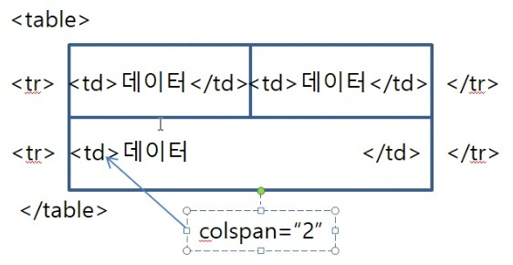
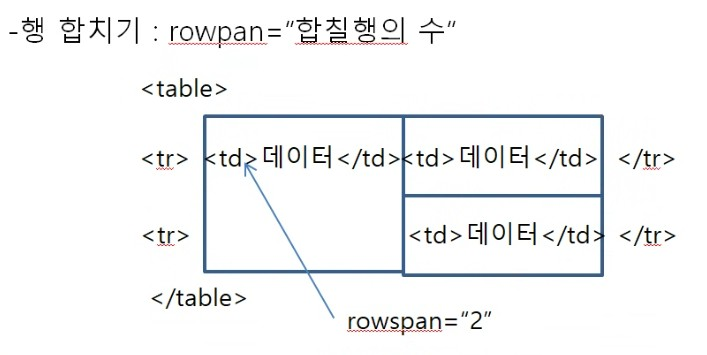

# Table 태그
- 데이터를 체계적으로 정리하여 보여줄 때
- ``<table>, <thead>, <tbody>, <tfoot>, <tr>, <th>, <td>`` 구성

사용법)
- `<table>`: 테이블을 시작할 때 사용
- 테이블 태그 대부분의 속성은 html5에서 지원하지 않는다.

``<table border="테두리선의 두께" bordercolor="선의색" width="넓이" heigth="높이" background="바닥이미지" bgcolor="바닥색" align="수평정렬" valign="수직정렬" cellpadding="td안여백" cellspacing="td사이여백">`` 

- `<tr>`: 행을 시작할 때 사용 (자식태그로 ``<th>, <td>``만 정의할 수 있다.)

``<tr height="높이" background="바닥이미지" bgcolor="바닥색" align="수평정렬" valign="수직정렬">``

- 수평정렬: left, right, center
- 수직정렬: top, middle, bottom

- `<th>`: 열의 제목을 설정할 때 사용 (진하게, 가운데 정렬 수행)
- `<td>`: 열에 들어가는 데이터를 설정할 때 사용 (일반글자, 왼쪽 정렬)

``<td width="넓이" height="높이" background="바닥이미지" bgcolor="바닥색" align="수평정렬" valign="수직정렬" colspa="합칠칸의 수" rowspan="합칠행의 수>``

- ``<thead>, <tbody>, <tfoot>``: 의미적인 태그

작성법
1. 테이블 시작
`<table>`

2. 행만들기
`<tr>`

3. 칸만들기
`<td>값</td>,,,`

4. 행 닫기
`</tr>`

n. 테이블 닫기
`</table>`

## 복잡한 모양의 테이블
- 칸 합치기: colspan="합칠칸의 수"

- 행 합치기: rowpan="합칠행의 수"

 

## thead, tbody, tfoot
- 사용자에게 보여지는 태그는 아니고, 의미와 기능이 제공되는 태그

`<thead>`: 테이블 내에서 제목 부분임을 표현하기 위한 의미적인 태그 
(항상 제일 위에서 보여진다.)

`<tbody>`: 테이블 내에서 본문 부분임을 표현하기 위한 의미적인 태그 
(항상 가운데에서 보여지진다.)

`<tfoot>`: 테이블 내에서 결과를 보여주기 위한 부분임을 표현하는 의미적인 태그 
(항상 가장 마지막에 보여진다.)

## 영역태그
- ``, 
``

* ``: 데이터가 있는 부분까지만 영역으로 설정, 사용시에 줄이 변경되지 않는다.
- 한 줄 내에서 데이터(JSP, Javascript)가 있는 부분을 구분하는 용도로 사용한다.

* `
`: web browser에 넓이 100%가 영역-사용시 줄이 변경된다. 
web page의 전체 디자인을 설정할 때 사용(페이지의 구조를 설정할 때 사용)