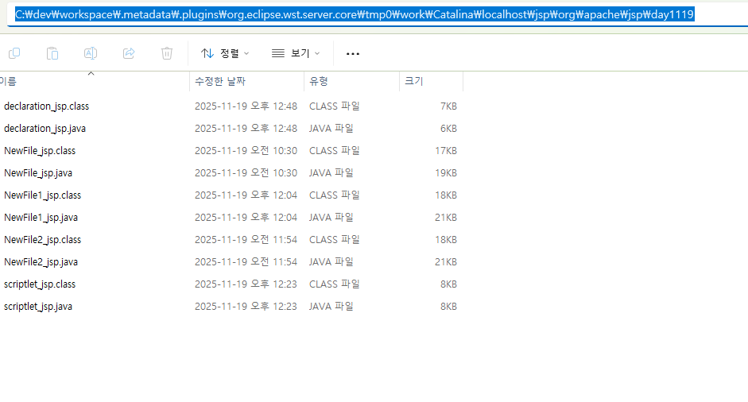

# JSP Tags
- JSP에서 기능을 정의할때 사용하는 태그들
- 5가지의 태그가 제공
- JSP가 자바로 변경될 때 Servlet으로 생성되고, 사용자에게는 JSP Tag의 내용이 보여지지 않는다.

## JSP TAGS 형식
``<% 코드,, %>``

|태그명|태그|설명|
|------|---|---------|
|지시자(directive) page|<%@ page ,,, %>|JSP페이지에 환경설정용|
|지시자(directive) include|<%@ include ,,, %>|다른 JSP를 끼워넣어 보여줄 때|
|선언(declaration)|<%! %>|JSP에서 method를 정의할 때<br> JSP에서 instance variable, static variable 선언할 때 사용|
|스크립틀렛(scriptlet)|<% %>|JSP에서 method 내 Java code를 정의할 때(지역변수 선언, 연산, 제어)|
|표현식(expression)|<%= %>|JSP에서 발생한 값을 web browser로 출력할 때|
|주석|<%-- --%>|JSP 태그가 Servlet 코드로 생성되는 것을 막을 때 사용한다.|

## scriptlet
- JSP에서 method내 자바코드 정의할 때 사용
- scriptlet 안에서 정의하는 코드는 JSP가 자바소스코드로 변경될 때 _jspService() method내 코드가 생성된다.
- 내장객체를 사용할 수 있다.

### scriptlet 사용법
``<% 내용 %>``

1.xxx.jsp 형태

```
<html>
<% int i=0; %>
<br>
<%
if(i 비교){

}
%>
<%= i %>
</html>
```

2.xxx.java 형태

```
public void _jspService(HttpServletRequest request, HttpServletResponse response) throws IOException, ServletException{

out.write("<html>"); //HTML 태그는 out.write() 매개변수로 들어가고

int i=0; //scriptlet은 코드로 생성되고

out.print(i); //표현식은 out.print() 매개변수로 들어간다.
}
```

3.java source code로 변경 위치


## 표현식(Expression)
- JSP에서 발생한 값을 web browser로 출력할 때 사용하는 태그
- 하나의 값만 출력할 수 있다.
- JspWriter(출력스트림) 내장 객체가 제공하는 print() method를 사용하여 web browser로 출력한다.
- JSP가 자바 코드로 변경될 때 _jspService() 안쪽으로 코드가 생성
- 내장객체를 사용할 수 있다

문법)

xxx.jsp형태
``<%= 변수명 %>, <%= 반환형이 있는 method() %>``

xxx.java형태
``out.print(변수명), out.print(method 명());``

## 선언(declaration)
- JSP에서 method를 정의하거나 instance variable, static variable를 선언할 때 사용
- JSP가 자바코드로 변경될 때 class field에 코드가 생성
- 내장객체를 사용할 수 없다

문법)

```
<%!
인스턴스 변수 정의
method가 정의
%>
```