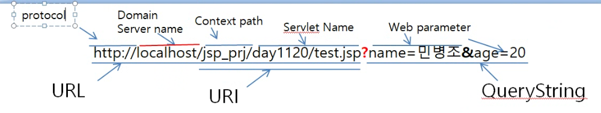

## 주석(Comment)
- JSP Tag를 감싸서 JSP Tag에 실행을 막을 때
- JSP가 Java Source Code로 변경될 때 JSP 주석으로 감싸진 JSP Tag는 Java Source Code로 생성되지 않는다.

### 주석 문법
``<%-- --%>``

### 주석 사용

```
<%--
<%
JSP코드
%>
--%>
```

## include directive
- 다른 JSP를 포함하여 보여줄 때 사용
- Java Source Code가 생성될 때 JSP간의 결합이 진행(JSP간의 변수 method, 업무 코드가 재사용된다)
- page directive의 충돌이 발생할 수 있다(같은 속성이 다른 값을 가지면 error가 발생 => 회피: 한쪽 JSP에만 값이 있거나, 페이지 지시자가 동일한 값을 가지면 error가 발생하지 않는다)
- include action tag(<jsp:include>, <c:import>)보다 속도가 빠르다
- Design의 병합보다는 기능(업무)의 병합시에 주로 사용된다

## include directive 사용법


``<%@ include page="끼워넣을 JSP URI">``

- URI: 서버 정보가 포함되지 않기 때문에 같은 서버내의 파일만 연결 가능하다.

## page directive
- JSP 페이지의 환경설정용
- 속성명은 대,소문자를 구분한다. 
- 속성은 반드시 공백이 나와야한다.

## page directive 문법
``<%@ page 속성="값" 속성="값" 속성="값" ,,, %>``

|속성명|동작|기본값|확장값|
|------|-----|---|------------
|language|JSP페이지에서 사용할 언어설정|java|OOP를 완벽하게 지원하는 언어
|extends|JSP가 자바 소스코드로 변경될 때 상속받을 부모 클래스를 설정|HttpJspBase(WAS마다 다름)|부모클래스는 CGI를 구현
|info|JSP페이지의 간단한 설명|""|JSP 페이지의 설명
|contentType|JSP가 응답될때 생성될 파일 설정|text/html|Web.xml에 설정된 MIME-type으로 변경가능
|pageEncoding|JSP파일 내에서 사용할 charset 설정|UTF-8|사용할 charset(8859_1, EUC-KR, KSC5601, UTF-8 등)
|session|JSP에서 WAS가 제공하는 session객체를 사용할 때|true|false
|isThread|JSP가 Thread로 동작하도록 설정|true|false
|buffer|JSP가 HTML로 생성될 때의 출력스트림의 크기|8kb|8kb, 16kb, 32kb
|autoFlush|스트림의 내용을 목적지로 자동 분출|true|false
|errorPage|JSP에서 에러가 발생했을 때 이동할 페이지 설정|""|Error가 발생했을 때 이동할 페이지 URL
|isErrorPage|JSP가 다른 JSP의 문제가 발생했을 때 대신 응답되는 페이지인지를 설정|false|true
|trimDirectiveWhitespaces|JSP에서 지시자나 JSP태그를 정의할 때 들어가는 엔터기호를 없앨 때|false|true
|isElignored|JSP에서 EL의 사용 여부 설정|false|true
|import|JSP에서 다른 패키지의 class나 interface를 사용해야 할 때|JSP를 서비스 하기위한 필수|필요한 패키지를 import