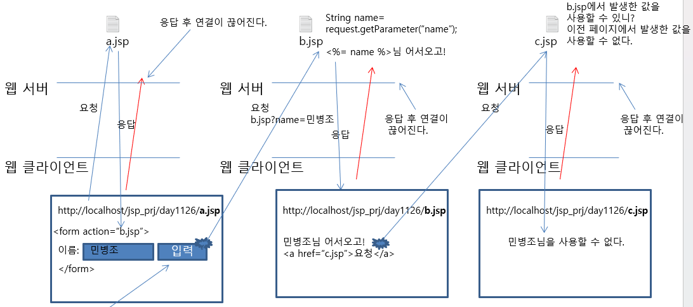

# Session
- 접속자의 정보를 서버 측 메모리에 저장하는 기술
- 접속자가 어떤 웹 브라우저를 사용하더라도, 접속자의 정보를 저장할 수 있다.
- 모든 값 저장할 수 있다.
- Servlet/JSP에서는 session을 사용하기 위해 HttpSession 인터페이스 제공
- 내장객체로 제공

## Session이 필요한 이유

1. a.jsp 파일에서 입력 버튼을 누르면 url과 `<form>`태그의 action 속성이 합쳐져서 url을 새로 생성
2. `<a>`태그로 c.jsp 파일의 경로를 설정했지만 c.jsp에서는 웹 서비스가 비연결형 서비스이므로 name의 값을 사용할 수 없다. 

## Session 사용

## HttpSession
- WAS에서 제공하는 session을 사용할 수 있는 객체
- Page directive에 session=true인 상태에서 사용할 수 있다.

1. 세션 얻기 (session="false"인 상태에서만 수행 => 권장x)
``HttpSession session=request.getSession();``

2. 세션에 값 설정
``session.setAttribute("이름", 값);``

3. 세션에서 값 얻기
``데이터형 변수명=(Casting)session.getAttribute("이름");``

4. 세션의 생존시간 설정(tomcat은 기본 생존 시간 30분)-이 페이지가 요청되면 모든 JSP 시간 적용
``session.setMaxInactiveInterval(초);``

5. 세션 값 삭제(세션은 살아있고 값만 삭제)
``session.removeAttribute("이름");``

6. 브라우저에 할당된 세션을 무효화
``session.invalidate();``