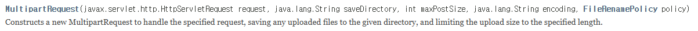

# FileUpload
- RFC 1867 HTML Form 기반 File Upload
- Web browser에서 지원하는 File Upload (대용량 파일(600MByte)인 경우 업로드 효율이 떨어진다.)
- File Upload Component가 필요(cos.jar, apache Commons FileUpload 등)
- 전송방식이 Post인 경우에만 파일이 전송된다. 
- 파일의 내용을 Base64로 인코딩하여 저장하거나, binary를 그대로 저장하는 방식 두가지가 있다.

## cos.jar
- servlet.com에서 제공(파일명이 한글이어도 처리가능, 중복파일명에 처리, 코드 짧다)
- apache commons fileupload: apache.org에서 제공(파일명이 한글인 경우 처리불편, 중복파일명은 덮어쓴다, 코드가 길다)

사용법)
1. 배포된 jar를 WEB-INF/lib에 넣는다

2. RFC 1867 HTML Form 기반 File Upload를 수행하기 위해 `<form>` 구성 (web parameter는 전송되지 않는다)
`<form method="post" enctype="multipart/form-data">`

3. Web parameter를 받기 위해서 file upload component에서 제공하는 method 사용

4. back-end page에서 파일업로드 컴포넌트를 사용한 업로드


	- 1. 파일 저장 디렉토리를 설정
	File saveDir=new File("저장경로");
	
	- 2. 업로드할 파일의 최대 크기 설정
	파일의 단위 (byte > kbyte > mbyte > gbyte > tbyte)
	int maxSize=1024*1024*600=600mbyte

사용법)

## web parameter 받기
- 일반 HTML Form Control

- 파일명 받기

## 이미지 미리보기
- 이미지를 선택하면 보안에 대한 이슈가 있어 바로 접근이 불가능하다.
=> JavaScript: FileReader stream을 사용하면 미리기보기가 가능(서버에 업로드 된 상태 아님)

작업순서)
1. HTML File Control 접근

```
$("selector").이벤트함수(function(evt){
	파일을 선택하면 해당 파일이 매개변수로 들어와 target 속성으로 얻을 수 있다.
	evt.target.file[0]
});
```

2. 스트림을 생성
``var reader=new FileReader();``

3. FileReader 객체의 onload 이벤트 핸들러 설정

```
reader.onload=function(evt){ //파일을 선택하면 > 파일 읽기 작업 실행 > 완료되면 onload 함수 호출
	$("미리보기 이미지").prop("src", evt.target.result); //src 속성에 선택된 파일의 명이 할당
};
```

4. 파일을 읽어들여 img 태그에 미리보기 설정
``