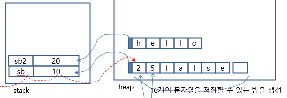

# 편리한 클래스의 사용
- 문자열 관련: String, StringBuffer, StringBuilder, StringTokenizer
- 수학: Math
- 날짜: Date, Calendar, LocalDate, LocalTime, Period, Duration
- 형식: SimpleDateFormat, DecimalFormat
- 난수: Random
- 지역: Locale

## String 
- 짧은 문자열을 다룰 때 사용하는 클래스(중복 문자열을 저장하지 않는다)

## StringBuffer, StringBuilder
- 긴 문자열을 다룰 때 사용하는 클래스
- 객체가 heap 문자열을 직접 저장한다.(중복 문자열을 저장)
- 속도가 빠르다.

* StringBuffer: JDK 1.0에서부터 제공, 속도 느림
* StringBuilder: JDK 1.5에서부터 제공, 속도가 빠름

1. 객체 생성
StringBuilder sb=new StringBuilder();
StringBuilder sb2=new StringBuilder("hello");
