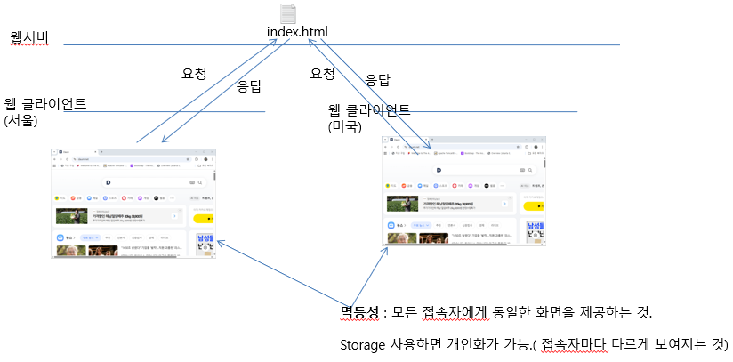

# Storage
- HTML5에서 제공하는 객체
- 접속자의 정보를 접속자의 web browser memory에 저장하는 기술
- localStorage, sessionStorage를 제공
- window 객체에서 제공
- 접속자 개인을 식별하는 개인화에 사용된다
- 접속자의 정보가 접속자 컴퓨터에 저장되므로, 접속자가 식별하고, 조작가능(변경, 삭제), 중요한 정보는 저장하지 않는다

## sessionStorage
- 접속자의 웹 브라우저가 열려 있는 동안에만 유지되는 storage
- 접속자의 정보를 다음 번 접속에는 사용할 수 없다(웹 브라우저가 종료되면 사라진다)
- 키와 값의 쌍으로 되어있다(키는 유일하고 값을 중복 가능)
- Cookie(문자열만 저장 가능)와 다르게 다양한 데이터형을 저장할 수 있다

사용법)
1. 객체 얻기
``var ss=window.sessionStorage;``

2. 값 설정: 키는 유일, 값은 중복, 중복된 키가 입력되면 기존에 키에 덮어쓴다.
``ss.setItem("키", "값");``

3. 값 얻기
``var value=ss.getItem("키");``

4. 아이템 삭제
``ss.removeItem("키");``

5. 모든 아이템 삭제
``ss.clear();``

## localStorage
- 접속자의 웹 브라우저가 종료되더라도 유지되는 storage
- 접속자의 정보를 다음 번 접속에도 사용할 수 있다(웹 브라우저가 종료되도 유지된다)
- 키와 값의 쌍으로 되어있다(키는 유일하고 값을 중복 가능)
- Cookie(문자열만 저장 가능)와 다르게 다양한 데이터형을 저장할 수 있다

사용법)
1. 객체 얻기
``var ls=window.localStorage;``

2. 값 설정: 키는 유일, 값은 중복, 중복된 키가 입력되면 기존에 키에 덮어쓴다.
``ls.setItem("키", "값");``

3. 값 얻기
``var value=ls.getItem("키");``

4. 아이템 삭제
``ls.removeItem("키");``

5. 모든 아이템 삭제
``ls.clear();``