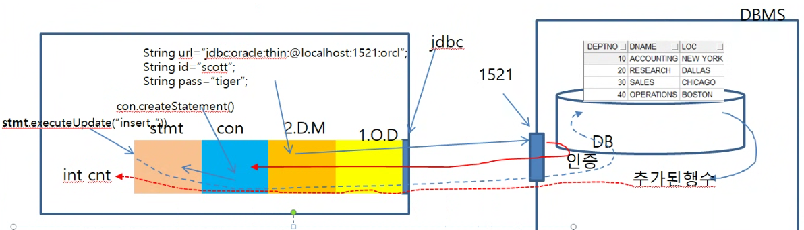

## select
- 여러 행 조회

1. 드라이버로딩
2. Connection 얻기 - autocommit 기본(setAutocommit(false))
3. 쿼리문 실행 객체 얻기
4. 쿼리문 수행 후 결과 얻기
``String selectQuery="select deptno,dname,loc from dept";``

//ResultSet은 커서의 제어권을 받는 객체, DB의 데이터형을 Java 언어의 데이터 형으로 변경
쿼리문이 실행되었을때 레코드의 현재위치를 가리키는 객체의 제어권을 반환
``ResultSet rs=stmt.executeQuery(selectQuery);``

while(rs.nextval) { //레코드 포인터(cursor)를 다음 레코드가 존재하는지 판단?
//레코드가 존재하면 커서를 다음 레코드로 이동시킨다.
//rs.getXxx("컬럼명"), rs.getXxx("컬럼인덱스")
rs.getInt("deptno") // rs.getInt(0) 
rs.getDouble("컬럼명")
rs.getString("컬럼명")
}

