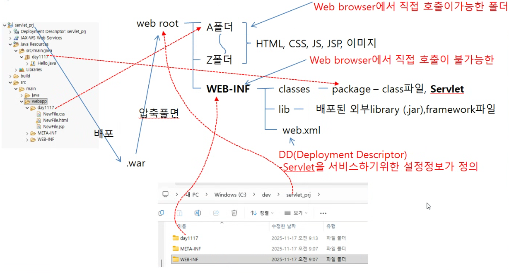
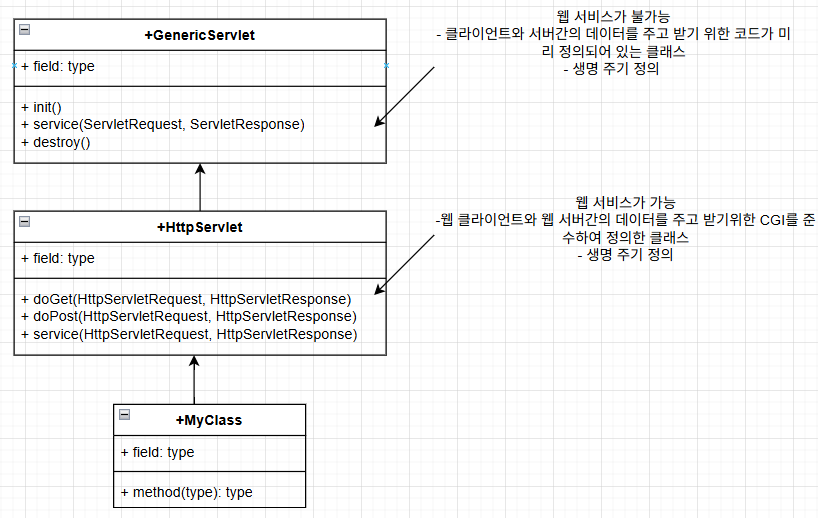

# Java Web Service 하기위한 폴더 구조


- Servlet/JSP는 동적으로 HTML을 생성하기 위한 언어(개인화, DB의 결과를 사용자에게 보여주기 위해서)
- Servlet/JSP는 WAS에 의존성이 있다.(WAS가 반드시 존재해야 한다)
	- WAS(Web Application Server): 웹에서 Servlet/JSP를 요청하면 HTML을 동적으로 생성하여 응답해줄 수 있는 프로그램
	
## Servlet 흐름


## Servlet 작성법
- 내가 만든 클래스가 웹 서비스가 되어져야한다.
	- 개발자가 CGI를 준수하여 클래스를 작성해야한다. => CGI를 구현하기 어려움 => CGI를 미리 구현해 놓은 클래스를 사용(is a-코드의 재사용성)
	
1.HttpServlet을 상속



```
public class MyClass extends HttpServlet{

```

2.웹에서 요청방식을 처리할 수 있는 method를 Override한다.
``<a href="URL">``
``<location.href="URL">``
``<form action="URL", method="GET, POST">``

*GET
- 접속자의 데이터를 web browser의 주소창을 사용하여 전송하는 방식
- 256자 이하의 소용량 문자열 데이터만 전송 가능 
- 보안에 취약(보안이 중요하지 않은 데이터 전송)
- 속도가 빠르다
- URL 뒤에 붙여서 전송

*GET 방식으로 요청

```
<a href="URL">, location.href="URL", <form action="URL", method="GET">

protected void doGet(HttpServletRequest req, HttpServletResponse res) throws IOException, ServletException {
	3. GET 방식의 요청이 있을 때 응답해줄 코드를 작성
}
```

*POST
- HTTP Protocol을 사용하여 데이터를 전송하는 방식(payload에 값을 넣어 전송)
- 256자 이상의 대용량 데이터를 전송할 수 있다.
- binary data 전송(파일 전송)
- 보안이 좋다(중요한 정보를 전송할 때 사용)
- 속도가 느리다
- payload 전송

*POST 방식으로 요청

```
<form action="URL", method="POST">

protected void doPost(HttpServletRequest req, HttpServletResponse res) throws IOException, ServletException {
	3. POST 방식의 요청이 있을 때 응답해줄 코드를 작성
}
```

*GET, POST 방식으로 요청

```
<form action="URL", method="POST">

protected void service(HttpServletRequest req, HttpServletResponse res) throws IOException, ServletException {
	3. GET, POST 방식의 요청이 있을 때 응답해줄 코드를 작성
}
```

3.응답방식을 설정(접속자에게 제공할 형식을 설정: MIME(Multipurpose Internet Mail Extensions)-type 설정)
- tomcat이 생성할 수 있는 MIME-type은 Servers/web.xml에 정의되어 있다.
``response.setContentType("text/html;charset=UTF-8");``

4.생성된 응답데이터를(HTML) 내보내기 위한 출력 스트림을 얻기
``PrintWriter out=response.getWriter();``

5.응답할 내용을 HTML 코드로 만들어서 출력 스트림으로 출력
``out.print("<html 태그>");``
``out.println("<html 태그>");``

Service 하기 위한 설정: 생성된 class파일을 web browser에서 인식하도록 만들기위해 DD 설정

## DD Servlet 등록
1.servlet 등록

```
<servlet>
<servlet-name>객체명</servlet-name>
<servlet-class>패키지명.class명</servlet-class>
</servlet>
```

2.URL mapping(web browser에서 클래스를 사용할 수 있도록 다른 이름으로 연결하는 것)

```
<servlet-mapping>
<servlet-name>객체명</servlet-name>
<url-pattern>/웹브라우저에서 인식할 이름</url-pattern>
</servlet-mapping>
```

## tomcat 실행
``startup.bat``

## web browser 열기 
- `<servlet-mapping>`노드의`<url-pattern>`에 정의된 URL을 사용하여 Servlet 호출
- 호출 URL) http://localhost/servlet_prj/이름
	- localhost: HDD에 hosts 파일을 찾고 localhost에 대응되는 ip address를 얻고 hosts 파일에 없다면 DNS로 요청을 보내서 서버의 ip를 얻는다.
	- sevlet_prj: HDD에 특정 directory를 웹 브라우저에서 사용하기 위해 server.xml에 <Context docBase="HDD 경로", path="/웹브라우저에서 사용할 이름">
	- 이름: DD에 설정된 이름
	
## servlet 작성순서
1. source code 작성
2. DD 설정
3. class파일을 서비스하는 위치에 배포
4. WAS 실행 
5. Web browser를 실행하여 <url-mapping>에 맞게 URL을 작성하고 서블렛 요청
6. 서블렛이 응답한 결과를 응답받아서 그림