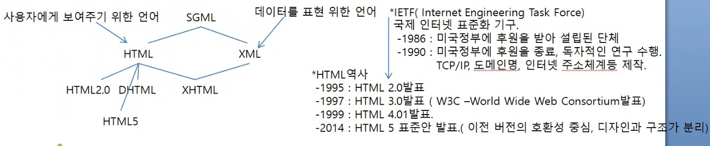

# Web
- WWW(World Wide Web) 또는 W3라고 한다.
- 문자, 이미지, 영상, 소리 등을 포함한 문서(Hyper Text)를 인터넷을 통해 전송하고, 검색할 수 있는 서비스

- internet: Hyper Text를 사용하여 인터넷상의 정보를 검색할 수 있는 프로그램<br>
		   컴퓨터를 프로토콜을 사용하여(TCP/IP) 연결하고, 정보를 주고 받을 수 있는 네트워크(1973년 빈트 서프와 밥 간이 분할되어 있는 네트워크를 하나의 통신망으로 연결하려는 의도를 가지고 명명한 네트워크 
		   
- URL, HTTP, HTML은 영국 Tim berners Lee가 최초 설계.

## Web에서 사용하는 기본 용어
- Hyper Text: 문서 안에서 다른 문서와 연결되는 연결점을 가진 문서
- Hyper Link: 문서간의 이동이나, 하나의 문서 내에서 이동을 하기 위한 링크
- Hyper Media: 영상이나 음성의 미디어를 서로 서로 연결하는 것
- HTML (Hyper Text Makrup Language): Hyper Text를 작성할 수 있는 언어
- HTTP: 웹 서버와 웹 클라이언트간의 통신을 하기위한 통신 규약
- URL: 인터넷에서 존재하는 다양한 자원들을 연결하기 위한 주소 체계<br>
	   프로토콜://호스트명:포트/경로/파일명의 형식으로<br>
	   
## HTML(Hyper Text Markup Language)
- tag언어(<시작태그>내용</끝태그>)
- 언어적인 요소(연산, 제어)가 배제된 그리기(Rendering)하기 위한 언어
- SGML에서 파생된 언어<br>



### HTML 구조
```hmtl
<!DOCTYPE html>
<html>
	<head>
		<title>타이틀바에 들어갈내용</title>
	</head>
	<body>
		내용
	</body>
</html>
```

### 태그
- 줄변경: `<br>, <p>`
- markup: `<big>, <small>, <sup>, <sub>, <u>, <strong>, <b>, <mark>, <strike>`
- 글꼴: `<font>`
- 이미지: `, <map>, <area>`
- 링크: `<a>`
- 목록: `<ul>, <ol>, <li>, <dl>, <dt>, <dd>`
- 글목록: `<h1>~<h6>`
- frame: `<frame>`
- 테이블: `<table>, <thead>, <tbody>, <tfoot>, <tr>, <th>, <td>`
- HTML Form Control: `<form>, <fieldset>, <legend>, <input>, <select>, <option>, <textarea>`
- 특수문자: `&nbsp;, &lt;`

### HTML Service

web server: HTML을 가지고 있다가, 요청이 발생하면 HTML을 응답해주는 프로그램<br>

web container: Servlet/JSP를 가지고 있다가, 요청이 발생하면 Servlet/JSP를 HTML로 변환하여(동적으로 생성) 응답해주는 프로그램<br> 

WAS(Web Application Service): Java EE의 모든 Spec을 서비스 해줄 수 있는 프로그램<br>

### 작성순서
1. 코드 작성
```hmtl
<!DOCTYPE html>
<html>
	<head>
		<title>타이틀바에 들어갈내용</title>
	</head>
	<body>
		내용
	</body>
</html>
```

2. 저장
파일명: 이름.html 또는 이름.htm(Windows 98등 예전 OS는 확장자를 3자 까지만 인식)으로 저장

3. Web Server 실행(eclipse 자동으로 실행)

4. 요청 URL을 사용하여 web server(WAS)에 요청 한다.

### 줄 변경 tag
- web browser는 \n으로 줄을 변경할 수 없다.
- `<br>,<br/>`: 줄을 변경할 위치에서 태그를 정의하면 줄을 바꿔서 다음 행을 그린다.
- 태그 작성법 
	- 태그 사이에 내용이 있을 때: <시작태그명>내용</끝태그명>
	- 태그 사이에 내용이 없을 때: <시작태그명></끝태그명> <- 줄여서 <시작태그명/>
- `<p>`: 문단태그

### HTML 주석
- HTML 태그의 실행을 막을 때 사용
- 모든 ML은 주석이 같다.
- 소스보기 하면 주석의 내용이 보인다.

사용법)
```HTML
<!--한줄 주석 -->

<!--
	여러
	줄 
	주석
-->

### Markup tag
- 본문에서 특정 부분을 강조하여 보여 주는 것	
- 진하게: `<b>, <strong>`

사용법) <b>내용</b>, <strong>내용</strong>

- 크기: `<big>`-HTML5에서 지원하지 않는 태그 -> web browser에서 Rendering은 잘 된다.
- 작게: `<small>`
- 밑줄: `<u>`-HTML5에서 지원하지 않는 태그
- 취소선: `<strike>`-HTML5에서 지원하지 않는 태그
- 윗첨자: `<sup>`
- 아랫첨자: `<sub>`
- 이탤릭: `<i>`
- 형광펜 효과: `<mark>` - HTML5에서 새로 지원하는 태그

### 속성(Attribute)이 있는 태그
- 개발자가 원하는 값을 넣어 태그를 다양한 형태로 사용할 때 속성을 사용
- 모든 태그에서 사용할 수 있는 속성을 global attribute 이라 한다.
- 속성의 값은 "값", '값', 값 3가지 형태로 사용할 수 있다.
- 태그마다 사용할 수 있는 속성은 이미 결정되어 있다.
- 속성은 기본값이 있어서 속성을 명시하지 않으면 설정된 기본 값이 들어간다.
- " "나 ' '가 없고 값에 공백이 있다면 처음 값만 속성 값으로 설정된다.

사용법)
	`<태그명 속성명="값" 속성명='값' 속성명=값>내용</태그명>`
	
### 글자 태그
- 글자색=문자열
- RGB(16진수: 0~F)
	- 약 160만 가지의 색이 표현 가능
- #000000(마크업 언어에서 숫자의 시작기호:#)~#FFFFFF
- 크기: 1~10까지 사용 가능하고, 기본값은 3
- 글꼴: 모든 글꼴, 기본값은 웹 브라우저에서 제공되는 기본 글꼴

`<font color="글자색" size="크기" face="글꼴">내용</font>`
