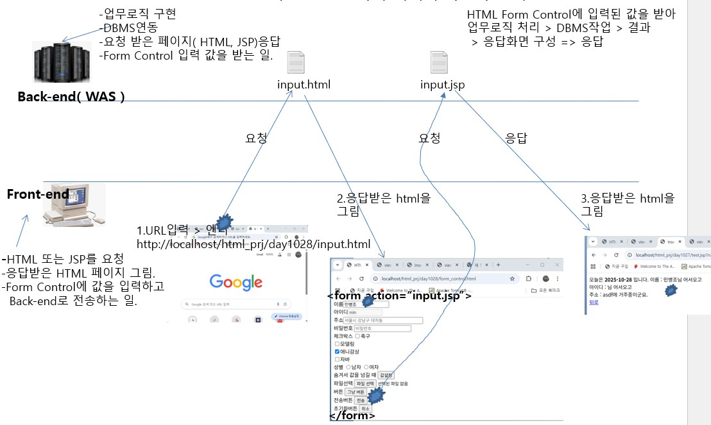

# Form
- back-end로 HTML Form Control들의 값을 전송하기 위해서 사용하는 태그
- `<input type="submit">`이 존재하고, 클릭되어야 back-end로 값이 전송된다.


사용법)
```HTML
<form action="값을 받을 back-end 페이지 URL" name="이름" id="아이디" method="값을 전송하기위한 방식` enctype="페이지 전송방식">
```

- method: web parameter를 back-end로 어떻게 전송할 것인지를 설정 
	- get방식
	- post방식
	
- enctype
	- Parameter 전송방식(기본 - file이 전송되지 않는다) 
		- application/x-www-form-urlencoded
	- File 전송방식(parameter가 전송되지 않는다)
		- mulitipart/form-data
	
css로 숨김처리를 해서 제공하고, 소스 상에서 영역을 구분하는 용도로 사용	

- `<fieldset>`
	- `<form>` 태그가 가진 HTML Form Control들의 영역을 보여주기 위한 테두리 선

- `<legend>`
	- title border
	
- `<labelfor="커서를 보낼 id명">`
	- 라벨을 설정하는 태그
	
사용법)
```HTML
<label for="name">글자</label><input type="text" id="name">
```

## Select
- 여러 옵션을 제공하고, 하나의 옵션을 선택하게 할 때

사용법)
```HTML
<select name="이름" size="보여줄 옵션의 개수" id="아이디" class="클래스명">
<option value="전송할 값">보여줄 값</option>
<option value="전송할 값" selected="selected">보여줄 값</option>
,,,
</select>
```

## TextArea
- 여러줄의 문자를 입력할 때

사용법)
``<textarea name="이름 " id="아이디" class="클래스명" rows="한번에 보여줄 줄 수" cols="한줄에 쓸 글자수">보여줄 문자열</textarea>``

## HTML5에서 추가된 Form Control
- 모든 웹 브라우저에서 지원하지 않을 수 도 있다.

## details
`<details>` : 메시지를 제공하고, 사용자가 메시지를 클릭하면, 숨겨놓은 제공할 내용을 열어서 보여주는 태그

사용법)
```HTML
<details>
	<summary>사용자에게 보여줄 메시지</summary>
	<span>사용자에게 보여줄 내용들</span>
</details>
```

## DataList
- 사용자가 클릭하거나 값을 입력했을 때 준비된 여러 옵션을 보여주고, 옵션을 클릭하면 값이 `<input type="text">`에 설정되는 객체 ( `<select>`과 유사 )<br>

사용법)
1. datalist를 사용할 input 객체 정의(list 속성을 사용)
``<input type="text" name="이름" list="datalist 의 아이디"/>`` <- 값이 입력되면 <datalist>의 <option> 중 해당 문자를 가지고 있는 옵션들만 제공된다.

2. data를 제공할 <datalist>를 정의
```HTML
<datatlist id="아이디">
	<option value="보여질 값"/>
	<option value="보여질 값"/>
	<option value="보여질 값"/>
	,,,
</datalist>
```

## Input type에 추가된 객체들
- input 태그에는 많은 Form Control들이 추가(web browser에서 지언하지 않으면 text로 보여짐)
- 날짜 선택(년-월-일)
``<input type="date" name="이름" id="아이디" class="클래스" value="날짜형식으로된 보여줄 날짜">``

