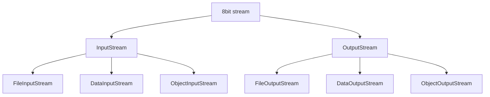
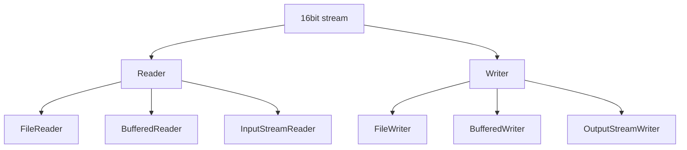

## IO stream
- Java API에서 입력과 출력을 할 수 있는 클래스
- 단방향 Stream(읽기는 읽기만 가능, 쓰기는 쓰기만 가능)
- java.io 패키지에서 관련 클래스들을 제공
- 8bit stream(byte기반 스트림)-> 모든 종류의 데이터를 읽어 들이거나 쓸 수 있다.(파일복사), 
16bit stream(문자열 기반 스트림)-> 독자 포멧이 없는 문자열 데이터만 읽고 쓸 수 있다.(메모장으로 열리는 파일) 두 가지를 제공

### stream 상속도

8bit stream(한번에 움직이는 데이터의 양은 적지만 속도가 빠르다): 모든 데이터를 읽기 위한 스트림

16bit stream(한번에 움직이는 데이터 양은 많지만 속도가 느리다): 문자열 데이터를 읽기 위한 스트림






## 시스템 입력


## File 입력
- 8bit Stream: 대상파일의 종류에 상관없이 깨지지 않게 모두 읽어 들일 수 있다.(파일 복사)
- 16bit Stream: 독자포멧이 없는 문자열 파일만 읽어 들일 수 있다.

사용법)
1. 파일에 스트림을 연결하여 파일의 내용을 읽는 일
``FileInputStream fis=new FileInputStream();``<- String 경로: 입력된 파일의 정보를 얻을 수 없다.
``FileReader fr=new FileReader();``<- java.io.File: 입력된 파일의 정보를 얻을 수 있다.

### java.io.File
java.io.File:파일에 대한 정보를 얻거나, 디렉토리를 생성하는 일, 파일 삭제하는 기능을 구현한 클래스

1.생성)
``File file=new File("파일의 경로");``

-파일의 정보 얻기)

2.파일이 존재?
``file.exists()``

3.파일의 크기
``file.length()``

4.디렉터리
``file.isDirectory()``

5.파일
``file.isFile()``

6.읽기 가능
``file.canRead()``

7.쓰기 가능
``file.canWrite()``

8.실행 가능
``file.canExecute()``

9.절대 경로
``file.getAbsolutePath()`` 여러개 존재 가능

-규범 경로
OS에서 파일에 접근하기 위한 단 하나의 경로
드라이브 경로가 대문자로만 사용

```
try{
 file.getCanonicalPath();
 }catch(IOException ie){
 
 }
```

10.파일이 존재하는 디렉토리만 얻기
``file.getParent()``

11.파일명 얻기
``file.getName()``

12.파일의 구분자 얻기
-OS에 맞게 구분자가 설정
``file.separtor``

13.숨김파일
``file.isHidden()``

14.파일이 마지막으로 수정된 날짜.
``long l=file.lastModified()``

*디렉토리 생성
-Os에서 제공하는 명령 mkdir 사용 (mkdir 디렉토리명)

1.생성할 디렉토리명을 가진 File 생성
``File file=new File("생성할 디렉토리명");``

2.디렉토리생성)
``file.mkdir()``//부모 디렉토리가 존재하지 않으면, 하위 디렉토리를 생성하지 않는다.
``file.mkdirs()``//부모 디렉토리가 존재하지 않으면, 부모 디렉토리부터 생성해준다.

*파일 삭제
1.삭제할 파일명을 가진 File 생성
``File file=new File("삭제할 파일의 경로와 파일명");``
2.삭제
``file.delete()``

*입력의 근원

0.파일 생성
File file=new File("읽어들일 파일의 경로");

1.스트림 생성
FileInputStream fis=new FileInputStream(file);

2.파일의 내용읽기
int readData=fis.read();//연결된 파일에 첫글자 하나 얻기

//파일의 모든 내용 읽기
int readData=0;
while((readData=fis.read()) != -1){

}