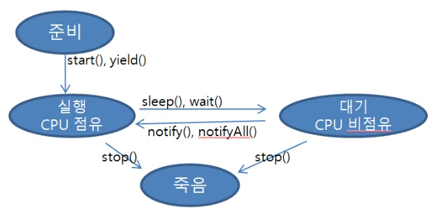
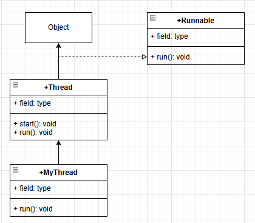

## Thread
- 동시에 일을 처리할 때(동시에 여러 method를 호출해야하는 경우)
- 프로그램 종료시간을 측정할 수 없다.
- 작은 process <- 실행 중인 프로그램(사용자, OS에 의해 실행), CPU가 한번에 처리하는 일의 단위
- CPU Scheduling의 두 가지 존재 <- 
시분할 CPU Scheduling(time sharing): OS에서 사용, 작업관리자의 역할이 매우 중요(작업관리자가 현재 실행중인 process 분석하여 CPU를 점유하는 시간을 설정) 
선점형 CPU Scheduling(running time): Java 사용, 작업관리자가 필요없고, 간단하게 Thread를 실행할 수 있다.
- CPU를 점유하고 있는 Process(Thread)를 강제로 분리할 때(Interrupt 발생)는 windows에는 작업관리자,
CUI- ctrl+c
- Thread는 실행할때 마다 다른 결과가 나온다.

*사용법)
- 상속 구현: extends Tread();
- 구현: implement Runnable

- Thread의 생명주기


*구현법)
-상속


1. Thread 상속
``public class MyThread extends Thread {``

2. run method override
```java
public void run(){
	3. Thread로 동작해야하는 코드 정의
	(동시에 실행되어야하는 코드)
}

4. 상속관계의 자식 클래스를 객체화
MyThread mt=new MyThread()